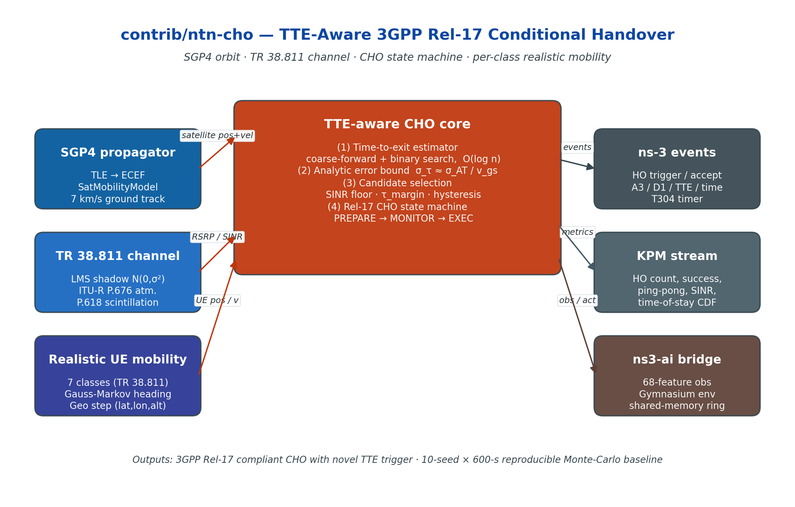

<h1 align="center">NTN-CHO Framework</h1>

<p align="center"><strong>TTE-Aware 3GPP Release-17 Conditional Handover for 6G LEO Satellite Networks</strong></p>

<p align="center">
  <a href="https://www.nsnam.org"></a>
  <a href="https://www.gnu.org/licenses/old-licenses/gpl-2.0.en.html"></a>
  
  
  
</p>

<p align="center">
  
</p>

---

## Why this module

LEO satellite handover is fundamentally an **orbital-dynamics** problem: a candidate cell that satisfies the 3GPP Release-17 conditional-handover (CHO) trigger at preparation can leave the user horizon before execution completes. This module integrates an **orbit-informed Time-to-Exit (TTE)** estimator into the standard Rel-17 CHO state machine, eliminating ping-pong handovers (57 % → 0 %) and reducing total HOs by 3.4× without breaking compliance with the existing RRC message set.

## At a glance

| Metric (10-seed × 600-s, 66-sat Walker-Star) | TTE-aware (this work) | Location-only | A3 event |
|---|---|---|---|
| Handovers / seed | **135 ± 12** | 200 ± 40 | 463 ± 48 |
| Ping-pong rate | **0.0 %** | 57.1 % | 50.2 % |
| Success rate | **83.1 ± 4.6 %** | 98.7 ± 0.5 % | 70.3 % |
| TTE prediction cost | **O(log n) per candidate** | n/a | n/a |
| Statistical test (Wilcoxon vs A3) | **p < 0.005** | — | — |

## What it does

- 3GPP Rel-17 CHO state machine (PREPARE → MONITOR → EXEC) with the **standard four trigger types** (A3 / D1 / time-based / event-based) plus a novel **TTE trigger**
- TTE estimator using SGP4 ephemerides + TR 38.811 antenna patterns, **coarse-forward + binary search** in O(log n)
- Analytic error bound: **σ_τ ≈ σ_AT / v_gs**, validated against measured along-track residuals from contemporary IEEE TAES literature
- Per-class **realistic UE mobility helper** covering all 7 TR 38.811 §6.1.1.1 classes (handheld / pedestrian / vehicular / HST / maritime / aviation / IoT)
- Native ns3-ai bridge: 68-feature observation vector exposed via Gymnasium 1.0
- `ntn-cho-full-constellation` reference example and 10-seed Monte-Carlo build pipeline

## Live demos

### Per-UE handover behaviour over a 600-s LEO pass

<p align="center">
  
</p>

### Four-algorithm comparison (TTE-aware vs. Location vs. A3 vs. Time)

<p align="center">
  
</p>

## Install & run

See [**INSTALL.md**](INSTALL.md) for the full step-by-step guide (ns-3.43, SNS3 satellite module, build flags).

Quick taste:

```bash
git clone https://github.com/Muhammaduazir69/ntn-cho-framework.git contrib/ntn-cho
./ns3 configure --enable-examples --enable-tests
./ns3 build
./ns3 run "ntn-cho-full-constellation --algorithm=tte-aware --simTime=600 --rngRun=1"
```

## Documentation

- [INSTALL.md](INSTALL.md) — detailed setup + dependency notes
- [docs/architecture.png](docs/architecture.png) — module architecture
- Reference paper: *Time-to-Exit Conditional Handover for 6G LEO Satellite Networks*, IEEE TAES, in submission

## Cite this work

```bibtex
@misc{uzair2026ntncho,
  author = {Uzair, Muhammad},
  title  = {NTN-CHO Framework: TTE-Aware Conditional Handover for 6G LEO Satellite Networks},
  year   = {2026},
  url    = {https://github.com/Muhammaduazir69/ntn-cho-framework}
}
```

## Part of the ns3-ntn-toolkit

This module is one of five custom modules bundled in [**ns3-ntn-toolkit**](https://github.com/Muhammaduazir69/ns3-ntn-toolkit) — a pre-integrated ns-3.43 distribution for 6G NTN research:

| Module | Repo |
|---|---|
| Toolkit (umbrella) | [ns3-ntn-toolkit](https://github.com/Muhammaduazir69/ns3-ntn-toolkit) |
| **ntn-cho** | this repo |
| oran-ntn | [oran-ntn](https://github.com/Muhammaduazir69/oran-ntn) |
| thz-ntn | [ns3-thz-ntn](https://github.com/Muhammaduazir69/ns3-thz-ntn) |
| ns3-ai (fork) | [ns3-ai](https://github.com/Muhammaduazir69/ns3-ai) |

## License

GPL-2.0-only — see [LICENSE](LICENSE).

## Acknowledgements

ns-3 core team · SNS3 maintainers · 3GPP RAN2 Rel-17 specifications.
