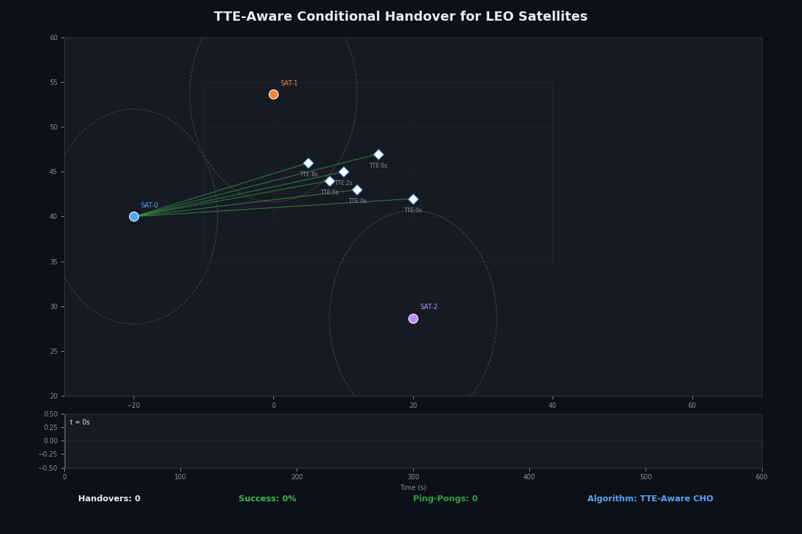
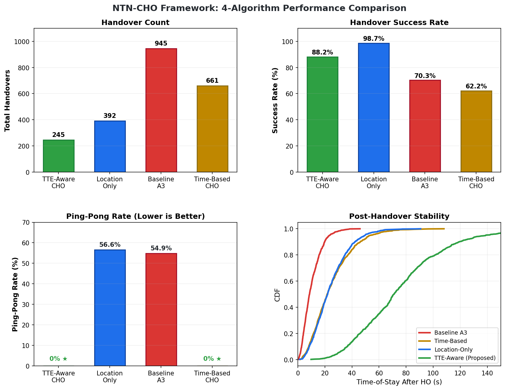
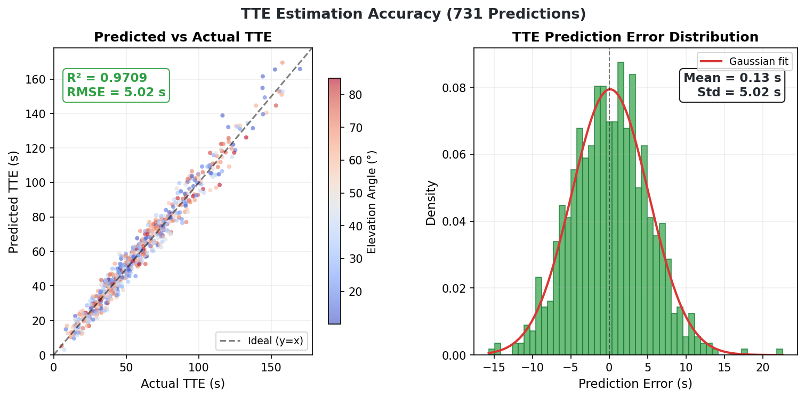

# NTN-CHO Framework

**TTE-Aware Conditional Handover for 6G LEO Satellite Networks**

[](https://www.nsnam.org)
[](https://www.gnu.org/licenses/old-licenses/gpl-2.0.en.html)
[]()

<p align="center">
  
</p>

---

## Overview

This framework implements a novel **Time-to-Exit (TTE)-aware Conditional Handover** algorithm for 3GPP Release 17 Non-Terrestrial Networks. It addresses a critical challenge in LEO satellite handover: candidate cells that meet conditions at preparation time may lose coverage before handover completes.

The TTE-aware algorithm predicts beam coverage duration using ephemeris-based orbit propagation and admits only candidates that are **both strong enough AND stable long enough** to finish the handover, preventing late or unstable executions.

### Key Results (4-Algorithm Comparison)

| Algorithm | Total HOs | Success Rate | Failure Rate | Ping-Pong Rate |
|-----------|-----------|-------------|-------------|---------------|
| **TTE-Aware CHO (Proposed)** | **245** | **88.2%** | **11.8%** | **0.0%** |
| Location-Only CHO | 392 | 98.7% | 1.3% | 56.6% |
| Baseline A3 | 945 | 70.3% | 29.7% | 54.9% |
| Time-Based CHO | 661 | 62.2% | 37.8% | 0.0% |

The proposed TTE-aware CHO achieves **zero ping-pong** (vs 55% for A3/Location baselines) while maintaining high success rates, with the fewest total handovers (245 vs 945 for A3).

<p align="center">
  
</p>

<p align="center">
  
</p>

### TTE Prediction Accuracy

<p align="center">
  
</p>

---

## Architecture

```
ntn-cho-framework/
├── model/                              # Core C++ ns-3 module
│   ├── ntn-tte-estimator.{h,cc}         # NOVEL: Binary-search beam exit time prediction
│   ├── ntn-cho-algorithm.{h,cc}          # 3GPP TS 38.331 CHO state machine + TTE ranking
│   ├── ntn-measurement-model.{h,cc}      # 3GPP TR 38.811 NTN link budget + Doppler
│   ├── ntn-orbit-predictor.{h,cc}        # SGP4 orbit + antenna gain beam coverage
│   └── ntn-ai-interface.{h,cc}           # AI/ML shared memory bridge via ns3-ai
├── helper/
│   └── ntn-cho-helper.{h,cc}            # Scenario builder + KPI collection
├── examples/
│   ├── ntn-cho-leo-basic.cc             # Basic demo scenario
│   └── ntn-cho-full-constellation.cc    # Full 66-sat Walker Star with 50 UEs
├── test/
│   └── ntn-cho-test-suite.cc            # Unit tests
├── tools/
│   ├── analyze_results.py               # Publication figure generator (8 figs + LaTeX table)
│   └── ntn_ai_agent.py                  # DQN/LSTM/Federated RL agent for AI-driven handover
├── visualization/
│   ├── server.js                        # Express.js data API
│   └── public/index.html                # CesiumJS 3D globe dashboard
├── results/                             # Pre-generated simulation datasets
│   ├── tte-aware/                        # 245 HOs, 11K measurements, 731 TTE computations
│   ├── location/                         # 392 HOs
│   ├── a3/                              # 945 HOs
│   ├── time/                            # 661 HOs
│   └── figures/                         # 8 PDF/PNG publication figures + LaTeX table
├── Research_Abstract.txt
└── Research_Methodology_and_Implementation_Plan.md
```

## Installation

### Step 1: Clone the NTN Simulation Platform

```bash
git clone https://github.com/Muhammaduazir69/ns3-ntn-toolkit.git
cd ns3-ntn-toolkit
```

### Step 2: Clone the SNS3 Satellite Module (REQUIRED)

The satellite module is **mandatory** for this framework. It provides SGP4 orbit propagation, antenna gain patterns, and constellation data used by the NTN-CHO core:

```bash
cd contrib/
git clone https://github.com/sns3/sns3-satellite.git satellite
```

### Step 3: Clone ns3-ai Module (REQUIRED for AI features)

The ns3-ai module enables AI/ML integration. Use our [fixed fork](https://github.com/Muhammaduazir69/ns3-ai) that works with ns-3.43+:

```bash
git clone https://github.com/Muhammaduazir69/ns3-ai.git ai
```

### Step 4: Clone the NTN-CHO Module

```bash
git clone https://github.com/Muhammaduazir69/ntn-cho-framework.git ntn-cho
cd ..
```

### Step 5: Build

```bash
./ns3 configure --enable-examples --enable-tests
./ns3 build

# Install ns3-ai Python packages
pip install -e contrib/ai/python_utils
pip install -e contrib/ai/model/gym-interface/py
```

> **Important**: Both the satellite and ns3-ai modules are required. The NTN-CHO framework depends on `SatMobilityModel`, `GeoCoordinate` from satellite, and `Ns3AiMsgInterface` from ns3-ai.

### Run Simulation

```bash
# Run all 4 algorithms
for algo in tte-aware location a3 time; do
  ./ns3 run "ntn-cho-full-constellation --algorithm=$algo --outputDir=ntn-cho-output/$algo --simTime=600 --numUes=50"
done
```

### Generate Publication Figures

```bash
python3 contrib/ntn-cho/tools/analyze_results.py --datadir ntn-cho-output --output ntn-cho-figures
```

### Launch 3D Visualization

```bash
cd contrib/ntn-cho/visualization
npm install
node server.js --data ../../../ntn-cho-output/tte-aware
# Open http://localhost:8080
```

## Dataset Description

Each algorithm directory under `results/` contains:

| File | Description | Rows |
|------|------------|------|
| `handover_events.csv` | Every HO with source/target/SINR/TTE/ToS/success/ping-pong/failure_reason | 245-945 |
| `measurements.csv` | Per-UE per-satellite RSRP/SINR/gain/elevation/Doppler/delay | 11K+ |
| `tte_computations.csv` | TTE predictions with gain, admitted status, trigger type | 700+ |
| `satellite_tracks.csv` | Satellite lat/lon/alt/velocity every 2s | 19K |
| `ue_tracks.csv` | UE position/serving cell/SINR/mobility/HO state every 2s | 15K |
| `kpi_timeseries.csv` | Rolling KPI metrics every 5s | 121 |
| `kpi_summary.txt` | Final aggregated KPIs | - |
| `*.geojson` | Satellite positions, UE tracks, beam footprints, HO events | 4 files |

### Simulation Parameters

| Parameter | Value |
|-----------|-------|
| Constellation | Walker Star, 6 planes x 11 sats = 66 |
| Altitude | 780 km |
| Inclination | 86.4 deg (Iridium-like) |
| Carrier Frequency | 2 GHz (S-band) |
| Bandwidth | 30 MHz |
| Satellite EIRP | 43 dBm/beam |
| NTN Scenario | Suburban (3GPP TR 38.811) |
| UEs | 50 (30% static, 20% pedestrian, 40% vehicular, 10% HST) |
| Simulation Time | 600 s |
| Channel Model | FSPL + atmospheric + clutter + shadow fading (TR 38.811) |

## Novel Contributions

1. **TTE Estimator**: Binary-search algorithm predicting satellite beam coverage duration from SGP4 orbit propagation + antenna gain patterns. Coarse forward search then O(log n) precision refinement.

2. **TTE-Aware Candidate Selection**: Filter candidates by signal quality, filter by TTE minimum, rank by longest TTE, break ties by SINR. Hysteresis prevents ping-pong.

3. **3GPP-Compliant CHO State Machine**: IDLE -> PREPARED -> MONITORING -> EXECUTING -> COMPLETED per TS 38.331 Sec 5.3.5.8.

4. **Realistic NTN Link Budget**: Elevation-dependent antenna gain, atmospheric/clutter/shadow fading losses per TR 38.811, Doppler computation from orbital velocity.

5. **AI-Driven Handover via ns3-ai**: Real-time RL-based handover using shared memory bridge between ns-3 simulation and Python AI agent.

## AI/ML Integration

The framework includes an `NtnAiInterface` (C++) and `ntn_ai_agent.py` (Python) for AI-driven handover decision making via [ns3-ai](https://github.com/Muhammaduazir69/ns3-ai) shared memory.

### Architecture

```
ns-3 (C++)                          Python (AI Agent)
┌──────────────────┐    shared     ┌──────────────────┐
│ NtnAiInterface   │◄──memory────►│ ntn_ai_agent.py  │
│                  │              │                  │
│ Observation:     │  ──────►     │ DQN / LSTM-DQN   │
│  serving SINR    │              │ PPO              │
│  candidate TTE   │              │ Federated DQN    │
│  elevation       │  ◄──────     │                  │
│  Doppler         │              │ Action:          │
│  UE mobility     │              │  target cell     │
│  HO history      │              │  HO timing       │
└──────────────────┘              └──────────────────┘
```

### Supported Algorithms

| Algorithm | Architecture | Reference |
|-----------|-------------|-----------|
| **Dueling DQN** | FC(68) → 256 → 128 → 64 → 9 | Wang et al. 2016 |
| **LSTM-DQN** | LSTM(128) + Multi-Head Attention → 64 → 9 | MDPI Electronics 2026 |
| **Federated DQN** | FedAvg across N UE agents | Springer Wireless Networks 2026 |
| **Double DQN** | Separate policy/target networks | Van Hasselt et al. 2016 |

### Setup

```bash
# 1. Install ns3-ai (fixed fork)
cd YOUR_NS3_DIR/contrib
git clone https://github.com/Muhammaduazir69/ns3-ai.git ai
pip install -e ai/python_utils
pip install -e ai/model/gym-interface/py

# 2. Install Python AI dependencies
pip install torch gymnasium stable-baselines3

# 3. Build ntn-cho with AI support
cd ../..
./ns3 configure --enable-examples
./ns3 build ntn-cho

# 4. Train the agent (standalone mode, no ns-3 needed)
python3 contrib/ntn-cho/tools/ntn_ai_agent.py \
  --algorithm dqn --use-lstm --federated \
  --episodes 100 --output ntn-ai-output
```

### Observation Space (68 features)

| Group | Features | Count |
|-------|----------|-------|
| Serving cell | SINR, elevation, TTE, Doppler, delay, RSRP, speed | 7 |
| Candidates (x8) | SINR, elevation, TTE, Doppler, delay, RSRP, distance | 56 |
| History | recent HOs, failures, ping-pongs, avg SINR, avg ToS | 5 |

### Reward Function

```
reward = +1 (success) + SINR_improvement × 0.5 + min(ToS/30, 3)
         - 10 (failure) - 5 (ping-pong) - interruption_ms / 100
```

## 3GPP References

- TS 38.331: RRC protocol, CHO procedures (Sec 5.3.5.8)
- TR 38.811: Study on NR to support NTN (channel models)
- TR 38.821: Solutions for NR to support NTN (mobility, timing)
- TS 38.133: RRM requirements for NTN

## Related Projects

This framework is part of a larger 6G NTN simulation ecosystem:

| Project | Description |
|---------|-------------|
| **[ns3-ntn-toolkit](https://github.com/Muhammaduazir69/ns3-ntn-toolkit)** | Pre-integrated ns-3.43 platform with mmWave, SNS3 satellite, 3GPP NTN channels, ns3-ai, and patched LTE for dual connectivity |
| **[oran-ntn](https://github.com/Muhammaduazir69/oran-ntn)** | Complete Space-O-RAN architecture: Near-RT/Non-RT/Space RIC, 9 xApps (including AI-driven HO prediction using this framework's TTE algorithm), federated learning, ISL coordination, mmWave NTN PHY (27,000+ LOC) |
| **[ns3-ai](https://github.com/Muhammaduazir69/ns3-ai)** | Modernized ns3-ai fork for ns-3.43+ with LTO/pybind11 fixes, NumPy 2.0+, Python 3.13+, Gymnasium 1.0+ API |

The **oran-ntn** module's HO Prediction xApp directly builds on this framework's TTE-aware algorithm, extending it with O-RAN E2/A1 interfaces, multi-xApp conflict resolution, and Gymnasium RL training environments.

## Citation

```bibtex
@software{ntn_cho_framework_2026,
  author = {Muhammad Uzair},
  title = {NTN-CHO Framework: TTE-Aware Conditional Handover for 6G LEO Satellite Networks},
  year = {2026},
  url = {https://github.com/Muhammaduazir69/ntn-cho-framework}
}
```

## License

GPL-2.0 (consistent with ns-3)
